# Real-Time AirBnB Data Pipeline (Kafka Micro-Batching)

> **Realise par :** Badreddine ABBA

## Description du Projet
Ce projet met en oeuvre un pipeline de donnees asynchrone utilisant **Apache Kafka** pour transformer un flux de donnees AirBnB. L'objectif est de simuler l'arrivee continue d'annonces via des fichiers CSV, de les ingerer dans Kafka, puis de les traiter par lots (Micro-Batching) avec **Pandas** avant de les stocker dans un Data Lake.

## Architecture Technique

```mermaid
flowchart LR
    subgraph Sources [Data Sources]
        CSV[Fichiers CSV<br>raw_data/]
    end

    subgraph Ingestion [Producteur]
        P{{Producer Python<br>csv.DictReader}}
    end

    subgraph Streaming [Apache Kafka]
        T[(Topic: topic_airbnb)]
    end

    subgraph Processing [Consommateur]
        C{{Consumer Python}}
        PL[Pipeline Pandas<br>airbnb_pipeline.py]
    end

    subgraph Storage [Data Lake]
        DL[(JSONL: Clean AirBnB)]
    end

    %% Flux
    CSV -- "Tri naturel + Lecture" --> P
    P -- "Produce (0.2s/msg)" --> T
    T -- "Subscribe" --> C
    C -- "Batch complet" --> PL
    PL -- "Commit apres save" --> DL

    %% Styles
    classDef source fill:#e3f2fd,stroke:#1e88e5,stroke-width:2px,color:#0d47a1;
    classDef python fill:#e8f5e9,stroke:#43a047,stroke-width:2px,color:#1b5e20;
    classDef kafka fill:#fff3e0,stroke:#fb8c00,stroke-width:2px,color:#e65100;
    classDef lake fill:#f3e5f5,stroke:#8e24aa,stroke-width:2px,color:#4a148c;

    class CSV source;
    class P,C,PL python;
    class T kafka;
    class DL lake;
```



## Stack Technologique
- **Orchestration** : Docker & Docker Compose
- **Streaming** : Apache Kafka 3.7 (Mode KRaft, port 9094)
- **Traitement** : Python 3.x, Pandas
- **Monitoring** : Kafbat UI (Port 8081)
- **Stockage** : JSON Lines (JSONL)

## Concepts Implementes
- **Nettoyage Regex Cible** : Suppression des retours a la ligne uniquement dans les colonnes texte (`select_dtypes`) pour garantir l'integrite du streaming.
- **Lecture Optimisee (csv.DictReader)** : Le Producer utilise le module natif `csv` au lieu de `pandas.iterrows()` pour une ingestion plus performante.
- **Tri Naturel** : Les fichiers CSV sont traites dans l'ordre numerique (1, 2, ..., 10, 11, 12).
- **Conversion de Types** : Fonction `_cast()` pour convertir les valeurs CSV (string) en types Python natifs (int, float).
- **Micro-Batching** : Traitement par lots configurable (`BATCH_SIZE`) pour optimiser les performances Pandas.
- **Arret Sans Perte** : Au Ctrl+C, le buffer incomplet est ignore et Kafka rejoue les messages au redemarrage (zero perte, zero doublon).
- **Exactly-Once** : Commit manuel des offsets Kafka uniquement apres persistance disque.
- **Separation des Responsabilites** : La logique metier (`airbnb_pipeline.py`) est isolee du code Kafka.
- **Archivage Automatique** : Deplacement des fichiers traites vers un dossier `archive/`.

## Guide de Demarrage

### 1. Installation
```bash
pip install -r requirements.txt
```

### 2. Preparation des donnees
```bash
python csv_split.py
```

### 3. Lancement de l'infrastructure
```bash
docker compose up -d
```

### 4. Execution du pipeline
Terminal 1 :
```bash
python consumer_airbnb.py
```

Terminal 2 :
```bash
python producer_airbnb.py
```
