<p align="center">
  
  
  
  
  
</p>

<h1 align="center">🔄 Real-Time Airbnb Data Pipeline</h1>
<h3 align="center">Kafka Micro-Batching · Feature Engineering · Data Lake</h3>

<p align="center">
  <em>Pipeline de données asynchrone de bout en bout — de fichiers CSV bruts à un Data Lake propre et exploitable.</em>
</p>

---

> **📚 Projet académique** — Master Big Data & Cloud Computing
> **📝 Module** : Data Preprocessing & Feature Engineering
> **👤 Réalisé par** : Badreddine ABBA

---

## 📋 Table des matières

- [Aperçu](#-aperçu)
- [Architecture](#-architecture)
- [Stack technologique](#-stack-technologique)
- [Structure du projet](#-structure-du-projet)
- [Concepts implémentés](#-concepts-implémentés)
- [Guide de démarrage](#-guide-de-démarrage)
- [Configuration](#-configuration)
- [Pipeline de nettoyage](#-pipeline-de-nettoyage)
- [Monitoring](#-monitoring)
- [Auteur](#-auteur)

---

## 🎯 Aperçu

Ce projet implémente un **pipeline de données en temps réel** pour transformer un flux d'annonces Airbnb brutes en données nettoyées et prêtes pour l'analyse.

### Problématique

Le dataset Airbnb Listings contient ~50 000 annonces avec de nombreuses imperfections :
- ❌ Valeurs manquantes (reviews, dates)
- ❌ Outliers de prix extrêmes
- ❌ Retours à la ligne dans les champs texte
- ❌ Types de données incohérents (tout en `string`)

### Solution

Un pipeline **event-driven** qui simule l'arrivée continue d'annonces via des fichiers CSV, les ingère dans Apache Kafka, les traite par micro-batches avec Pandas, puis les stocke dans un Data Lake au format JSONL — le tout avec une garantie **zéro perte de données**.

---

## 🏗 Architecture

```mermaid
flowchart LR
    subgraph Sources ["📄 Data Sources"]
        CSV[Fichiers CSV<br>raw_data/]
    end

    subgraph Ingestion ["🔹 Producteur"]
        P{{Producer Python<br>csv.DictReader}}
    end

    subgraph Streaming ["🟠 Apache Kafka"]
        T[(Topic: topic_airbnb)]
    end

    subgraph Processing ["🟢 Consommateur"]
        C{{Consumer Python}}
        PL[Pipeline Pandas<br>airbnb_pipeline.py]
    end

    subgraph Storage ["💾 Data Lake"]
        DL[(JSONL: Clean Airbnb)]
    end

    %% Flux
    CSV -- "Tri naturel + Lecture" --> P
    P -- "Produce (0.2s/msg)" --> T
    T -- "Subscribe" --> C
    C -- "Batch complet (×500)" --> PL
    PL -- "Commit après save" --> DL

    %% Styles
    classDef source fill:#e3f2fd,stroke:#1e88e5,stroke-width:2px,color:#0d47a1;
    classDef python fill:#e8f5e9,stroke:#43a047,stroke-width:2px,color:#1b5e20;
    classDef kafka fill:#fff3e0,stroke:#fb8c00,stroke-width:2px,color:#e65100;
    classDef lake fill:#f3e5f5,stroke:#8e24aa,stroke-width:2px,color:#4a148c;

    class CSV source;
    class P,C,PL python;
    class T kafka;
    class DL lake;
```



---

## 🛠 Stack technologique

| Composant | Technologie | Rôle |
|-----------|-------------|------|
| **Streaming** | Apache Kafka 3.7 (KRaft) | Broker de messages — mode sans ZooKeeper |
| **Ingestion** | Python · `confluent-kafka` | Producer : lecture CSV → publication Kafka |
| **Traitement** | Python · `Pandas` | Consumer : micro-batching + feature engineering |
| **Orchestration** | Docker & Docker Compose | Conteneurisation de l'infrastructure |
| **Monitoring** | Kafbat UI | Dashboard temps réel des topics et messages |
| **Stockage** | JSON Lines (JSONL) | Format de sortie Data Lake |

---

## 📁 Structure du projet

```
airbnb-kafka-microbatch-pipeline/
│
├── 📄 producer_airbnb.py       # Kafka Producer — ingestion des CSV
├── 📄 consumer_airbnb.py       # Kafka Consumer — micro-batching
├── 📄 airbnb_pipeline.py       # Pipeline Pandas — nettoyage & feature engineering
├── 📄 csv_split.py             # Découpage du CSV source en micro-fichiers
│
├── 📄 docker-compose.yml       # Infrastructure Kafka + Kafbat UI
├── 📄 requirements.txt         # Dépendances Python
├── 📄 .env                     # Variables d'environnement
│
├── 📂 raw_data/                # Micro-fichiers CSV en attente de traitement
├── 📂 archive/                 # Fichiers CSV traités (archivés automatiquement)
├── 📂 data_lake/               # Données nettoyées au format JSONL
│   └── 📂 airbnb_clean/        # Batches de sortie horodatés
│
└── 📄 listings.csv             # Dataset source Airbnb (~50 000 annonces)
```

---

## 💡 Concepts implémentés

### 🔁 Micro-Batching
Traitement par lots configurables (`BATCH_SIZE = 500`) pour optimiser les performances Pandas tout en maintenant une faible latence.

### 🔒 Exactly-Once Delivery
Commit manuel des offsets Kafka **uniquement après persistance sur disque**. Aucune donnée n'est marquée comme consommée tant qu'elle n'est pas sauvegardée.

### 🛡 Arrêt sans perte (Graceful Shutdown)
Au `Ctrl+C`, le buffer incomplet est volontairement ignoré. Comme les offsets n'ont pas été commités, Kafka **rejoue automatiquement** ces messages au redémarrage — zéro perte, zéro doublon.

### 🧹 Nettoyage Regex ciblé
Suppression des retours à la ligne (`\r\n`, `\n`) uniquement dans les colonnes texte, détectées via `select_dtypes(include=['object'])`, pour garantir l'intégrité du streaming CSV.

### ⚡ Lecture optimisée
Le Producer utilise `csv.DictReader` (module natif Python) au lieu de `pandas.iterrows()` pour une ingestion significativement plus performante.

### 🔢 Tri naturel
Les fichiers CSV sont traités dans l'ordre numérique correct : `1, 2, ..., 10, 11, 12` (et non `1, 10, 11, 12, 2, ...`).

### 🔀 Conversion de types
Fonction `_cast()` pour convertir intelligemment les valeurs CSV (string brutes) en types Python natifs (`int`, `float`, `None`).

### 📦 Séparation des responsabilités
La logique métier de nettoyage (`airbnb_pipeline.py`) est **complètement isolée** du code Kafka, facilitant les tests et la maintenance.

### 🗂 Archivage automatique
Les fichiers CSV traités sont automatiquement déplacés vers le dossier `archive/`.

---

## 🚀 Guide de démarrage

### Prérequis

- **Python** 3.8+
- **Docker** & Docker Compose
- **Git**

### 1. Cloner le dépôt

```bash
git clone https://github.com/badr-abba/airbnb-kafka-microbatch-pipeline.git
cd airbnb-kafka-microbatch-pipeline
```

### 2. Installer les dépendances

```bash
pip install -r requirements.txt
```

### 3. Préparer les données

Découper le fichier CSV source en micro-fichiers de 1 000 lignes :

```bash
python csv_split.py
```

### 4. Lancer l'infrastructure Kafka

```bash
docker compose up -d
```

> ⏳ Attendre quelques secondes que Kafka soit prêt et que le topic `topic_airbnb` soit créé automatiquement.

### 5. Démarrer le pipeline

**Terminal 1** — Lancer le Consumer (en premier) :
```bash
python consumer_airbnb.py
```

**Terminal 2** — Lancer le Producer :
```bash
python producer_airbnb.py
```

### 6. Observer les résultats

Les données nettoyées apparaissent dans `data_lake/airbnb_clean/` au format JSONL :

```bash
ls data_lake/airbnb_clean/
# batch_airbnb_20260605_143022.jsonl
# batch_airbnb_20260605_143045.jsonl
# ...
```

---

## ⚙ Configuration

Les variables sont configurables via le fichier `.env` ou directement dans le code :

| Variable | Valeur par défaut | Description |
|----------|-------------------|-------------|
| `KAFKA_BROKER` | `localhost:9094` | Adresse du broker Kafka |
| `TOPIC_NAME` | `topic_airbnb` | Nom du topic Kafka |
| `BATCH_SIZE` | `500` | Taille des micro-batches (Consumer) |
| `SEND_DELAY` | `0.2` | Délai entre chaque message (Producer) |
| `CHUNK_SIZE` | `1000` | Lignes par micro-fichier CSV |

---

## 🧪 Pipeline de nettoyage

Le module `airbnb_pipeline.py` applique les transformations suivantes sur chaque micro-batch :

```
Données brutes (DataFrame)
    │
    ├── 1. Remplissage reviews_per_month manquantes → 0
    │
    ├── 2. Suppression des lignes sans last_review
    │
    ├── 3. Conversion last_review → datetime
    │
    ├── 4. Conversion price → numérique
    │
    ├── 5. Suppression des outliers de prix par IQR
    │      Q1 - 1.5 × IQR  ←  prix valide  →  Q3 + 1.5 × IQR
    │
    └── ✅ Données propres → sauvegarde JSONL
```

---

## 📊 Monitoring

Le dashboard **Kafbat UI** est accessible à l'adresse :

```
http://localhost:8081
```

Il permet de visualiser en temps réel :
- 📌 Les topics et leurs partitions
- 📨 Les messages publiés et consommés
- 📈 Les offsets et le lag du consumer group
- 🔍 Le contenu des messages individuels

---

## 🛑 Arrêt propre

```bash
# Arrêter le Producer/Consumer
Ctrl+C

# Arrêter l'infrastructure Kafka
docker compose down
```

> 💡 Les messages non commités seront automatiquement rejoués au prochain démarrage du Consumer.

---

## 👤 Auteur

**Badreddine ABBA**
- 🎓 Master Big Data & Cloud Computing
- 🔗 [GitHub](https://github.com/badr-abba)

---

<p align="center">
  <em>Projet académique — Module « Data Preprocessing & Feature Engineering »</em><br>
  <strong>Master Big Data & Cloud Computing</strong>
</p>
